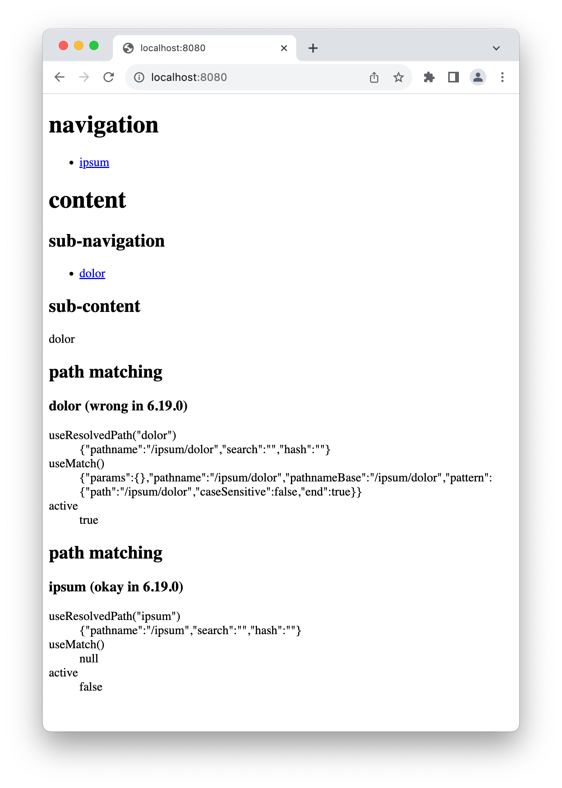
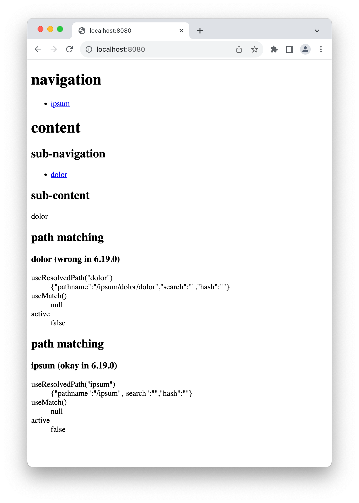

# react-router-test

Repository to demonstrate changed behavior of `useResolvedPath()` in
react-router@6.19.0

## How to use

1. Run `yarn install` to install dependencies.
2. Run `yarn dev` to start webpack-dev-server on http://localhost:8080.
3. Observe output of "path matches / ipsum", seems okay.
4. Click "ipsum". Output of "path matches / ipsum" and "path matches / dolor"
   both seem okay:
   ```
   useResolvedPath("ipsum") -> {"pathname":"/ipsum",…}
   useResolvedPath("dolor") -> {"pathname":"/ipsum/dolor",…}
   ```
5. Click "dolor". Output of "path matches / dolor" now has unexpectedly changed,
   while output of "path matches / ipsum" is still okay:
   ```
   useResolvedPath("dolor") -> {"pathname":"/ipsum/dolor/dolor",…}
   ```
6. In `package.json`, change `^6.19.0` to `<6.19.0`.
7. Run `yarn install` and `yarn dev` again.
8. Repeat instructions above and observe that "path matches / dolor" is correct:
   ```
   useResolvedPath("dolor") -> {"pathname":"/ipsum/dolor",…}
   ```

## Screenshots

| This seems okay (6.18.0)                                    | This seems wrong (6.19.0)                                         |
| ----------------------------------------------------------- | ----------------------------------------------------------------- |
|                  |                       |
| `useResolvedPath("dolor") -> {"pathname":"/ipsum/dolor",…}` | `useResolvedPath("dolor") -> {"pathname":"/ipsum/dolor/dolor",…}` |
